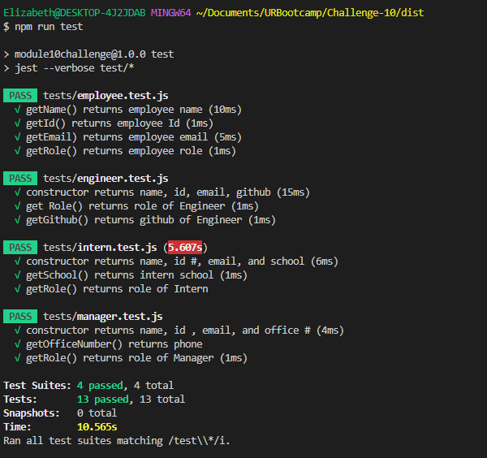
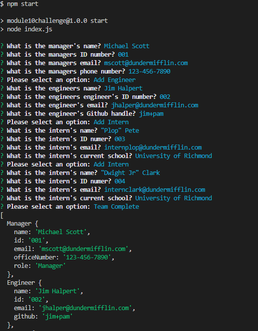
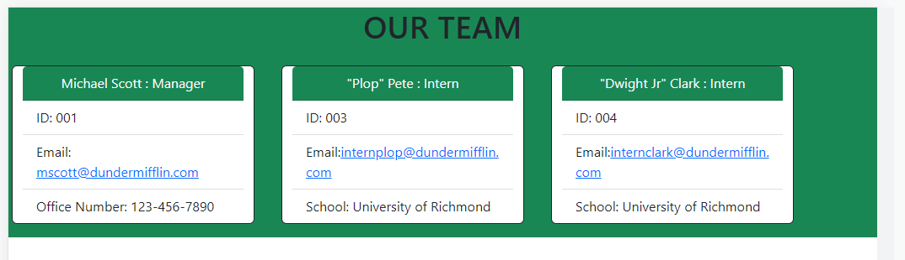

## ELL Team Generator

## Description

I created this app to allow users to create their own HTML document that contains their team members with easy to access information they might need! 

## Installation

🌟npm i;
npm run test, 
npm start

in the myTeam.html click alt+b to open myTeam.html in your local browser!

## Usage

The [repo](https://github.com/elizabeth189/ELL-teamGenerator) allows you to view the files!
You can look through the files to check out my team generator!

Here is what the test should look like:  

And here's an example of the prompts:  

Finally, here is what my html document looks like! 

## License

Please refer to the LICENSE in the repo.

## Credits

Class assignments and lessons related to this module were used when building this project, along with outside resources such as:
-StackOverflow
-W3Schools
-Mozilla
-ChatGPT (great at explaining errors!)

## Questions

Please feel free to reach out with any questions by email or connect through [LinkedIn](https://www.linkedin.com/in/elizabeth-lopez-lopez-345b3b14a/)

## Video
coming soon!